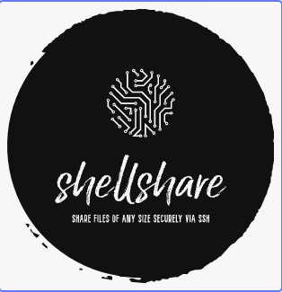

<p align="center">
  
</p>


# ShellShare - Share Files of Any Size Securely via SSH

ShellShare revolutionizes file sharing by leveraging the SSH protocol, empowering users to securely share files of any size across the internet. This powerful tool simplifies the sharing process while ensuring data security.


## Features

- **Seamless File Sharing**
- **File Size Agnostic**: Share files of any size hassle-free.
- **Secure Protocol**: Utilize the SSH protocol for robust encryption and secure transfers.
- User-Friendly Interface
- **Generate Shareable Links**: Easily create links for others to download shared files.
- **Effortless Sharing**: Share files effortlessly without worrying about limitations.

ShellShare offers a straightforward solution for sharing files securely over the internet using SSH. Simplify your file-sharing experience today!


## How it Works

ShellShare establishes a robust tunnel between an SSH server and an HTTP server using Golang channels, facilitating seamless file streaming and sharing.

#### Core Functionality:
1. **Tunnel Establishment**:Creates a tunnel between SSH and HTTP servers leveraging Golang channels.
2. **SSH Session & File Streaming**:Initiates an SSH session for efficient file streaming and sharing.
3. **Shareable Link Generation**:Upon receiving a signal in the SSH server, generates a shareable link.
4. **Data Propagation**: Pushes signal data through Golang channels.
5. **Download Link Activation**:Upon user interaction (clicking the download link), the server listens to the designated channel.
6. **File Wrapping & HTTP Response**:Starts encapsulating file bytes into the HTTP response for download.


___
ShellShare orchestrates a streamlined process, seamlessly integrating SSH and HTTP servers for efficient file sharing. It ensures data transmission security and a smooth user experience, simplifying the sharing and retrieval of files via generated links.
___


## Run Locally

1. Clone the project

```bash
  git clone git@github.com:gauravgola96/shellshare.git
```

2. Go to the project directory

```bash
cd shellshare/
```
```bash
go mod tidy
```

```bash
go install <path-to/shellshare/cmd/shellshare>
```

###### **shellshare should be present**
```bash
ls $GOPATH/bin 
```

3. Install dependencies:

Mongo (Not required if only using SSH) :https://www.mongodb.com/docs/manual/installation/

4. Start the server

```bash
  cd <path>/shellshare
```
```bash
  shellshare combined
```


## Usage/Examples
1.
```bash
ssh localhost -p 2222 <path to file>

```

### output
```bash
WARNING : Only file size upto 2GB is allowed !!! ⚠️  

Your download link 👀 : http://localhost:8000/v1/redirect/download/018c1ba5-4467-7842-ae24-63fba2a72c7d
 
 
Please don't kill this session 
Your link will expire in 15 minutes, If not used 🤗 

```
2.
```bash
ssh localhost -p 2222 filename="file.yaml" < file.yaml
```